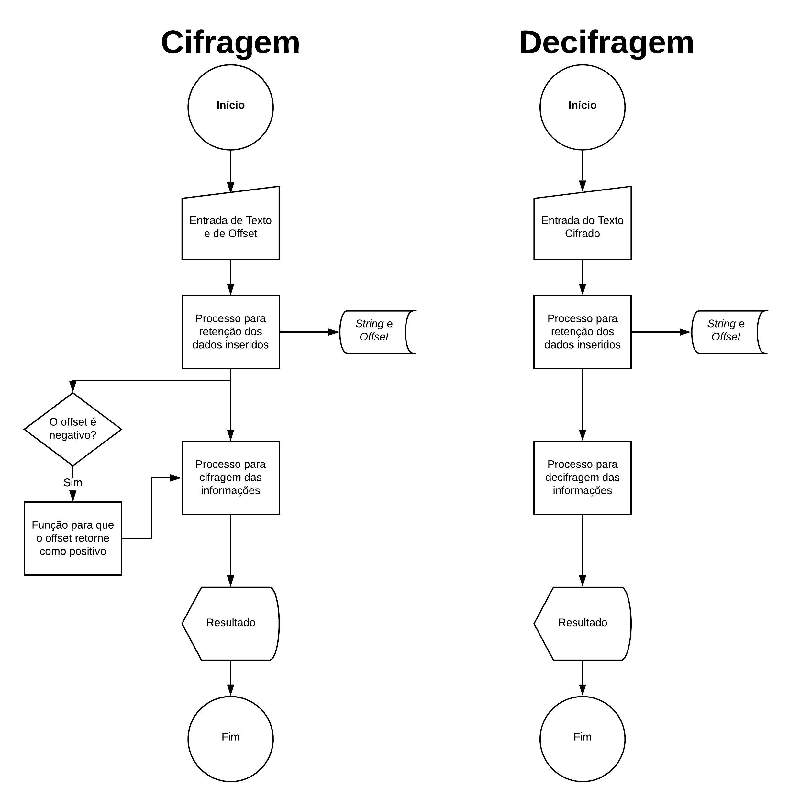

# Projeto | Cifra de César | My Secrets

## Índice

- [Projeto | Cifra de César | My Secrets](#projeto--cifra-de-c%c3%a9sar--my-secrets)
  - [Índice](#%c3%8dndice)
  - [1. Prefácio](#1-pref%c3%a1cio)
  - [2. Resumo do projeto](#2-resumo-do-projeto)
  - [3. Fluxograma do Projeto](#3-fluxograma-do-projeto)
  - [4. Desenho do Projeto](#4-desenho-do-projeto)
    - [Interface do usuário (UI)](#interface-do-usu%c3%a1rio-ui)
    - [Scripts / Arquivos](#scripts--arquivos)
  - [5. Publico-Alvo](#5-publico-alvo)

***

## 1. Prefácio

A cifra de cézar é uma técnica de cifragem muito simples. Segundo o escritor Suetônio, foi utilizada por Júlio César para se comunicar com seus generais, protegendo mensagens militares.

O seu funcionamento ocorre mediante uma substituição monoalfabética, o que significa que cada letra do texto plano é substituída por outra letra do alfabeto no texto criptografado (cifrado), de forma constante (sempre as mesmas letras são utilizadas). O deslocamento é determinado a partir de um número (que podemos designar como "offset").

A cifra de César funciona mediante substituição, em que cada letra do texto original é
substituida por outra que se encontra há um número fixo de posições
(deslocamento) mais a frente do mesmo alfabeto.

## 2. Resumo do projeto

O projeto foi elaborado a fim de permitir que o usuário possa inserir mensagens secretas em caracteres alfabéticos minúsculos e maísculos para serem cifrados e decifrados (_string_), a partir de uma chave de deslocamento (_offset_).

A interface do projeto possibilita ao usuário inserir páginas de seus diários, caso queira, e salvar o texto criptografado em editores de texto para, posteriormente, serem descriptografados.

Foi utilizado no projeto: HTML, CSS e Javascript.

## 3. Fluxograma do Projeto

A estrutura do projeto foi elaborada segundo o seguinte Fluxograma:

## 4. Desenho do Projeto

### Interface do usuário (UI)

O projeto foi desenhado para permitir que o usuário possa:

* Inserir uma mensagem (*texto*) para ser cifrada (em maiúsculas e minúsculas);
* Eleger um _offset_ indicando quantas posições de deslocamento de caracteres quer que a cifra utilize (números positivos e negativos);
* Ver o resultado da mensagem cifrada;
* Inserir uma mensagem (*texto*) para ser decifrada; e
* Ver o resultado da mensagem decifrada.
* Não realizar a cifragem de números, "ç" e caracteres especiais.

### Scripts / Arquivos

* `README.md`.
* `src/index.html`
* `src/cipher.js`: processamento e realização da cifragem e decifragem.
* `src/index.js`: processamento dos eventos de DOM e chamado das funções `cipher.encode()` e `cipher.decode()`.
* `test/cipher.spec.js`: arquivo de testes.

## 5. Publico-Alvo

O projeto é destinado para adolescentes que desejem criptografar as suas ideias e segredos.
